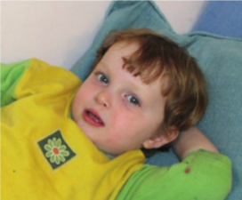
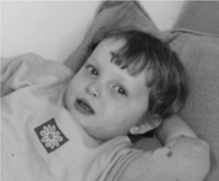
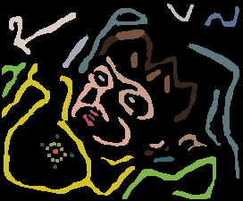
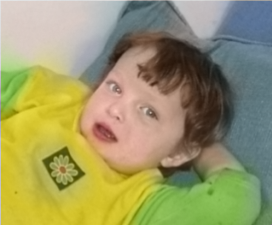
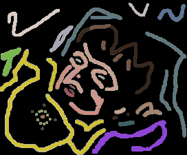
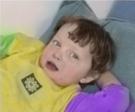
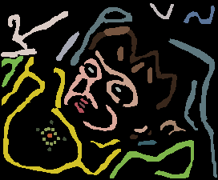
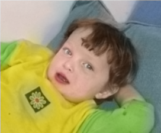

# Colorization using Inpainting
## Description
This is an implementation of Color Inpainting using C/C++ on Qt platform.
The algorithm is written in C.

## What's the Colorization
Colorization is a technique to convert a grayscale image into a colored image.
- [Film colorization - Wikipedia, the free encyclopedia](https://en.wikipedia.org/wiki/Film_colorization)
- [Hand-colouring of photographs - Wikipedia, the free encyclopedia](https://en.wikipedia.org/wiki/Hand-colouring_of_photographs)

## Example
| original | grayscale | mask | output |
| :------: | :-------: | :--: | :----: |
|  |  |  |  |
|  |  |  |  |
|  |  |  |  |
- 3000 iteration
- λ=0.02
- Δt=0.2

## Directory tree
```
include/      header files
inImg_db/     sample input images
lib_c/        C code
lib_qc/       C structure <-> C++ data conversion
outImg_db/    sample output images
```

## Reference
[Marcelo Bertalmio, Guillermo Sapiro, Vincent Caselles, and Coloma Ballester. 2000. Image inpainting. In Proceedings of the 27th annual conference on Computer graphics and interactive techniques (SIGGRAPH '00). ACM Press/Addison-Wesley Publishing Co., New York, NY, USA, 417-424. DOI=http://dx.doi.org/10.1145/344779.344972](http://www.dtic.upf.edu/~mbertalmio/bertalmi.pdf)
